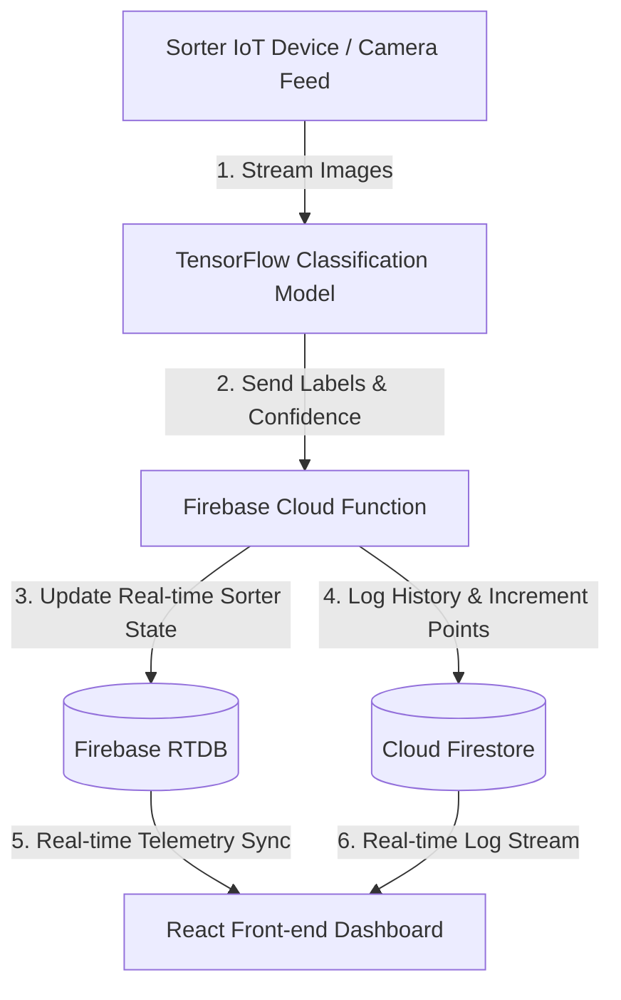

# Backend Plan - PET Bottle Sorting and Classification System

This document outlines the architecture, database schemas, security rules, and real-time triggers for the backend of the PET Bottle Sorting and Classification System. It is designed to integrate with a TensorFlow image classification model.

---

## 1. System Architecture

The backend utilizes **Firebase** services for real-time status updates and historical persistence:
1. **Firebase Realtime Database (RTDB):** Handles active device telemetry, scanner sensor triggers, and physical sorting gate control flags.
2. **Cloud Firestore:** Stores persistent user profiles, total recycled items, historical points, and detailed scan analysis logs.
3. **Firebase Cloud Functions:** Operates as middleware to safely calculate points and handle TensorFlow callback requests.
4. **Firebase Authentication:** Handles user authentication (via anonymous sign-in or OAuth credentials).



---

## 2. Database Schemas

### 2.1 Firebase Realtime Database (RTDB)
RTDB stores the volatile state of the sorting machine. Reading/writing is optimized for millisecond-level synchronization with the hardware controller.

**Schema Path:** `/devices/{deviceId}`
```json
{
  "device_info": {
    "model": "EcoSort-V1",
    "firmware": "2.4.1",
    "status": "online" // "online" | "offline"
  },
  "telemetry": {
    "bin_fill_level": 35.5, // Percentage of storage capacity filled
    "total_cycles": 1420,  // Lifetime item classification count
    "last_updated": 1782806290000 // Epoch milliseconds
  },
  "current_scan": {
    "scan_id": "scan_uuid_99982",
    "state": "analyzing", // "idle" | "analyzing" | "sorting_pet" | "rejecting"
    "raw_image_url": "https://storage.googleapis.com/.../temp_frame.jpg",
    "gate_open": false // Hardware command line
  }
}
```

### 2.2 Cloud Firestore
Firestore handles long-term persistent storage, which is indexed and structured for analytics.

#### Collection: `users`
Tracks individual user profile stats and recycling points.
- **Document ID:** `user_uid`
```json
{
  "display_name": "Marcus Aurelius",
  "email": "marcus@eco.org",
  "created_at": "2026-06-25T10:00:00Z",
  "stats": {
    "total_points": 340,
    "pet_bottles_sorted": 34,
    "non_pet_recycled": 12,
    "last_active": "2026-06-30T01:58:00Z"
  }
}
```

#### Collection: `classification_logs`
Detailed history of all classification attempts.
- **Document ID:** Auto-generated UUID
```json
{
  "device_id": "sorter_01",
  "user_uid": "user_uid", // Optional, if linked to a user session
  "timestamp": "2026-06-30T01:58:00Z",
  "image_url": "https://storage.googleapis.com/.../logged_bottle_49.jpg",
  "classification": {
    "predicted_class": "PET Bottle", // "PET Bottle" | "Aluminium Can" | "Glass Bottle" | "Other Plastic"
    "is_pet_bottle": true,
    "confidence": 0.982
  },
  "sorting_action": "accepted", // "accepted" | "rejected"
  "points_awarded": 10
}
```

---

## 3. Firebase Security Rules

To protect database integrity, read/write actions must be restricted.

### 3.1 Cloud Firestore Rules
Only authenticated users can read their own profile, and only authenticated device service accounts (or Cloud Functions) can update points and insert logs.

```javascript
rules_version = '2';
service cloud.firestore {
  match /databases/{database}/documents {
    
    // User Profile Rules
    match /users/{userId} {
      allow read: if request.auth != null && request.auth.uid == userId;
      allow create: if request.auth != null && request.auth.uid == userId;
      allow update: if false; // Point updates must occur via Cloud Functions ONLY
    }
    
    // Classification Logs Rules
    match /classification_logs/{logId} {
      allow read: if request.auth != null; // Registered users can view the stream
      allow write: if false; // Write requests only permitted from backend microservices
    }
  }
}
```

### 3.2 Realtime Database Rules
The physical sorter reads its gate control values from RTDB, while the TensorFlow model writes current scanning telemetry.

```json
{
  "rules": {
    "devices": {
      "$deviceId": {
        ".read": "auth != null",
        "telemetry": {
          ".write": "auth != null && auth.token.is_sorter_device == true"
        },
        "current_scan": {
          ".write": "auth != null && (auth.token.is_sorter_device == true || auth.token.is_classifier_api == true)"
        }
      }
    }
  }
}
```

---

## 4. TensorFlow & Sorter Action Flow

When the camera sensor detects an object:
1. **Trigger:** The sensor uploads the camera frame to Firebase Storage and sets the RTDB path `/devices/sorter_01/current_scan/state` to `"analyzing"`.
2. **Classification:** The TensorFlow model fetches the image, executes inference, and evaluates the label:
   ```python
   # TensorFlow Inference Mockup (Python API / Node.js)
   predictions = model.predict(preprocessed_image)
   predicted_class = classes[np.argmax(predictions)] # e.g., "PET Bottle"
   confidence = float(np.max(predictions))
   ```
3. **Gate Automation:**
   - **If PET Bottle (Confidence > 80%):**
     - Sorter sets `/current_scan/gate_open` to `true` (triggering physical servo).
     - Sorter pushes `points_awarded` (+10) to Firestore logs and increments user's `total_points`.
   - **If Non-PET:**
     - Sorter sets `/current_scan/gate_open` to `false` (diverts to trash/landfill channel).
     - Sorter records log entry with `points_awarded` = `0`.
4. **Reset:** Once the item falls through the sorting chute (verified by proximity sensor), the RTDB state resets to `"idle"`.
